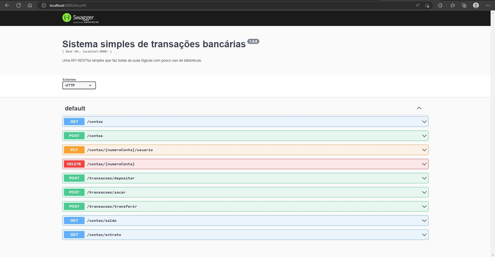

# API RESTfull para um sistema bancário

## Back-end para um sistema bancário cuja interface de usuário (front-end) ainda não está pronta. Este aplicativo web terá as seguintes funcionalidades:
- Criar, listar, editar e excluir contas bancárias
- Depositar e sacar valores de uma conta bancária
- Transferir valores entre contas bancárias
- Consultar saldo de uma conta bancária
- Emitir extrato bancário de uma conta

 #### - O que precisa ser feito para que a api funcione localmente?
 
      1° - Baixe a engine (motor) que interpretará as funcionalidades das dependências em javascript, o Node, através deste link: https://nodejs.org/en/download/
      2° - Selecione o instalador de acordo com o seu sistema operacional e arquitetura (32-bit ou 64-bit)
      3° - Ao abrir o instalador do Node, pressione o botão "next" até o final.

### Segunda parte

      4° - Clone este repositório para o seu computador.
      5° - Escolha uma pasta para baixar todo o conteúdo que você vê nesse repositório.
      6° - Ao escolher, abra seu terminal clicando dentro desta pasta com o lado direito do mouse e escolhendo a opção "abrir terminal".
      7° - Com o terminal aberto, digite os seguintes comandos:
        - git clone (com o método que você preferir, ou através do SSH ou HTTPS. Você tem acesso a isso no botão verde "Code" nesta mesma página)
      8° - Quando a pasta tiver sido totalmente baixada, entre na mesma através do terminal escrevendo os seguintes comandos:
        - cd "Web-app-sistema-bancario-API
"

### Terceira parte

      9° - Execute o comando no diretório raíz (onde está localizada a pasta "src"): "npm i".
      10° - Espere o interpretador instalar todos os arquivos necessários para rodar o projeto.
      11° - Execute o comando no mesmo local: "npm run dev".
      12° - Aguarde a abertura do servidor Backend no seu terminal para acessar a seguinte URL no seu navegador: http://localhost:8000/docs e começar a testar as rotas através da interface gerada pela biblioteca Swagger.

### A página que deverá ser exibida para você é a seguinte: 

### - Muito obrigado pela boa vontade!